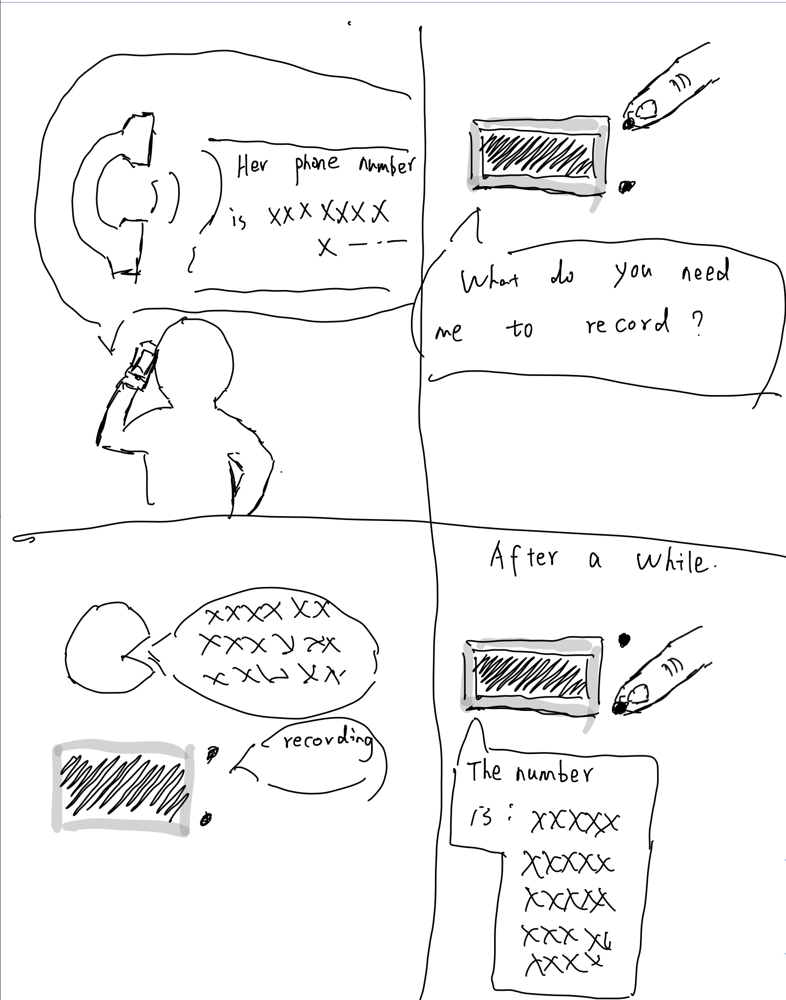

# Chatterboxes
[](https://www.youtube.com/embed/Q8FWzLMobx0?start=19)

In this lab, we want you to design interaction with a speech-enabled device--something that listens and talks to you. This device can do anything *but* control lights (since we already did that in Lab 1).  First, we want you first to storyboard what you imagine the conversational interaction to be like. Then, you will use wizarding techniques to elicit examples of what people might say, ask, or respond.  We then want you to use the examples collected from at least two other people to inform the redesign of the device.

We will focus on **audio** as the main modality for interaction to start; these general techniques can be extended to **video**, **haptics** or other interactive mechanisms in the second part of the Lab.

## Prep for Part 1: Get the Latest Content and Pick up Additional Parts 

### Pick up Additional Parts

As mentioned during the class, we ordered additional mini microphone for Lab 3. Also, a new part that has finally arrived is encoder! Please remember to pick them up from the TA.

### Get the Latest Content

As always, pull updates from the class Interactive-Lab-Hub to both your Pi and your own GitHub repo. As we discussed in the class, there are 2 ways you can do so:

**\[recommended\]**Option 1: On the Pi, `cd` to your `Interactive-Lab-Hub`, pull the updates from upstream (class lab-hub) and push the updates back to your own GitHub repo. You will need the *personal access token* for this.

```
pi@ixe00:~$ cd Interactive-Lab-Hub
pi@ixe00:~/Interactive-Lab-Hub $ git pull upstream Fall2021
pi@ixe00:~/Interactive-Lab-Hub $ git add .
pi@ixe00:~/Interactive-Lab-Hub $ git commit -m "get lab3 updates"
pi@ixe00:~/Interactive-Lab-Hub $ git push
```

Option 2: On your your own GitHub repo, [create pull request](https://github.com/FAR-Lab/Developing-and-Designing-Interactive-Devices/blob/2021Fall/readings/Submitting%20Labs.md) to get updates from the class Interactive-Lab-Hub. After you have latest updates online, go on your Pi, `cd` to your `Interactive-Lab-Hub` and use `git pull` to get updates from your own GitHub repo.

## Part 1.
### Text to Speech 

In this part of lab, we are going to start peeking into the world of audio on your Pi! 

We will be using a USB microphone, and the speaker on your webcamera. (Originally we intended to use the microphone on the web camera, but it does not seem to work on Linux.) In the home directory of your Pi, there is a folder called `text2speech` containing several shell scripts. `cd` to the folder and list out all the files by `ls`:

```
pi@ixe00:~/text2speech $ ls
Download        festival_demo.sh  GoogleTTS_demo.sh  pico2text_demo.sh
espeak_demo.sh  flite_demo.sh     lookdave.wav
```

You can run these shell files by typing `./filename`, for example, typing `./espeak_demo.sh` and see what happens. Take some time to look at each script and see how it works. You can see a script by typing `cat filename`. For instance:

```
pi@ixe00:~/text2speech $ cat festival_demo.sh 
#from: https://elinux.org/RPi_Text_to_Speech_(Speech_Synthesis)#Festival_Text_to_Speech

echo "Just what do you think you're doing, Dave?" | festival --tts
```

Now, you might wonder what exactly is a `.sh` file? Typically, a `.sh` file is a shell script which you can execute in a terminal. The example files we offer here are for you to figure out the ways to play with audio on your Pi!

You can also play audio files directly with `aplay filename`. Try typing `aplay lookdave.wav`.

\*\***Write your own shell file to use your favorite of these TTS engines to have your Pi greet you by name.**\*\*
(This shell file should be saved to your own repo for this lab.)

Bonus: If this topic is very exciting to you, you can try out this new TTS system we recently learned about: https://github.com/rhasspy/larynx

### Speech to Text

Now examine the `speech2text` folder. We are using a speech recognition engine, [Vosk](https://alphacephei.com/vosk/), which is made by researchers at Carnegie Mellon University. Vosk is amazing because it is an offline speech recognition engine; that is, all the processing for the speech recognition is happening onboard the Raspberry Pi. 

In particular, look at `test_words.py` and make sure you understand how the vocab is defined. Then try `./vosk_demo_mic.sh`

One thing you might need to pay attention to is the audio input setting of Pi. Since you are plugging the USB cable of your webcam to your Pi at the same time to act as speaker, the default input might be set to the webcam microphone, which will not be working for recording.

\*\***Write your own shell file that verbally asks for a numerical based input (such as a phone number, zipcode, number of pets, etc) and records the answer the respondent provides.**\*\*

Bonus Activity:

If you are really excited about Speech to Text, you can try out [Mozilla DeepSpeech](https://github.com/mozilla/DeepSpeech) and [voice2json](http://voice2json.org/install.html)
There is an included [dspeech](./dspeech) demo  on the Pi. If you're interested in trying it out, we suggest you create a seperarate virutal environment for it . Create a new Python virtual environment by typing the following commands.

```
pi@ixe00:~ $ virtualenv dspeechexercise
pi@ixe00:~ $ source dspeechexercise/bin/activate
(dspeechexercise) pi@ixe00:~ $ 
```

### Serving Pages

In Lab 1, we served a webpage with flask. In this lab, you may find it useful to serve a webpage for the controller on a remote device. Here is a simple example of a webserver.

```
pi@ixe00:~/Interactive-Lab-Hub/Lab 3 $ python server.py
 * Serving Flask app "server" (lazy loading)
 * Environment: production
   WARNING: This is a development server. Do not use it in a production deployment.
   Use a production WSGI server instead.
 * Debug mode: on
 * Running on http://0.0.0.0:5000/ (Press CTRL+C to quit)
 * Restarting with stat
 * Debugger is active!
 * Debugger PIN: 162-573-883
```
From a remote browser on the same network, check to make sure your webserver is working by going to `http://<YourPiIPAddress>:5000`. You should be able to see "Hello World" on the webpage.

### Storyboard

Storyboard and/or use a Verplank diagram to design a speech-enabled device. (Stuck? Make a device that talks for dogs. If that is too stupid, find an application that is better than that.) 

\*\***Post your storyboard and diagram here.**\*\*


Write out what you imagine the dialogue to be. Use cards, post-its, or whatever method helps you develop alternatives or group responses. 

\*\***I was working with Shenxin Jiang (jians10) after a brainstorming session we find out that sometims when people are on the phone or driving, they may have a hard time of remembering a list of numbe (could be someone's phone number or zipcode ect), so we would like to have our device to act as a digital memo to help record number information.**\*\*

### Acting out the dialogue

Find a partner, and *without sharing the script with your partner* try out the dialogue you've designed, where you (as the device designer) act as the device you are designing.  Please record this interaction (for example, using Zoom's record feature).

### The video demo of our dialogue can be find [here](https://www.youtube.com/watch?v=1PuzkOuhvbY)

\*\***The dialogue acted out as what I expect but there are some little problems first is during a phone call, the user will keep talking and the device may have a hard time determining whether to stop recording.**\*\*

### Wizarding with the Pi (optional)
In the [demo directory](./demo), you will find an example Wizard of Oz project. In that project, you can see how audio and sensor data is streamed from the Pi to a wizard controller that runs in the browser.  You may use this demo code as a template. By running the `app.py` script, you can see how audio and sensor data (Adafruit MPU-6050 6-DoF Accel and Gyro Sensor) is streamed from the Pi to a wizard controller that runs in the browser `http://<YouPiIPAddress>:5000`. You can control what the system says from the controller as well!

\*\***Describe if the dialogue seemed different than what you imagined, or when acted out, when it was wizarded, and how.**\*\*

# Lab 3 Part 2

For Part 2, you will redesign the interaction with the speech-enabled device using the data collected, as well as feedback from part 1.

## Prep for Part 2

1. What are concrete things that could use improvement in the design of your device? For example: wording, timing, anticipation of misunderstandings...
2. What are other modes of interaction _beyond speech_ that you might also use to clarify how to interact?
3. Make a new storyboard, diagram and/or script based on these reflections.

## Prototype your system

The system should:
* use the Raspberry Pi 
* use one or more sensors
* require participants to speak to it. 

*Document how the system works*

The given text to voice tool is not that useful that sometimes it can be hard to understand what the device is saying, so we plan to utilize the screen and let it display responses from our device. The main interaction between the user and device is by the joystick. By pushing the joystick to the left, the device knows it has to record something and by pushing joystick to the right, the device knows it has to play something. 

The system works like this: The user is busy on the phone while his/her friend on the other side of the phone gives a phone number that the user has to memorize. The user push the joystick on our device to the left, the device asks what phone number should it record. The user then repeat after the phone number he/she heard to the device and it has been stored. Later the day when the use want to access this phone number memo, he/she just pushes the joystick to the right, the device then tells the phone number stored.

*Include videos or screencaptures of both the system and the controller.*

#### Link to the video demo of the system is [here](https://www.youtube.com/watch?v=z3lPWa0Yx_U)

#### Link to the controller demo is [here](https://www.youtube.com/watch?v=l8HIGQzAWhI)


ee

## Test the system
Try to get at least two people to interact with your system. (Ideally, you would inform them that there is a wizard _after_ the interaction, but we recognize that can be hard.)

Answer the following:

### What worked well about the system and what didn't?
We are using a joystick for the user to interacte with the device, by pushing it toward different directions, the system will respond differently and triger different mode. In this way, it is easy for the user to let the device know what they want. But the system is still not that easy to use becasue the user has to push the joystick and it can be hard to do during a phone call. It's also inaccurrate at times that the speech to text tool will sometimes record less and sometimes more then the user want. The timing when the device starts to record is critical for this type of phone number memo. In an ideal situation, the device will be wake up and record when it captures some key words like "Let me take this number down" so the user does not have to manually start the recording.

### What worked well about the controller and what didn't?

We are not able to set up the server due to issues we don't know, we wrote code in python to serve as a script and managed to use our command line from a computer as a controller, when the device is going to speak, we simply type in the stored phone number and let the device speech.

### What lessons can you take away from the WoZ interactions for designing a more autonomous version of the system?

\*\**your answer here*\*\*


### How could you use your system to create a dataset of interaction? What other sensing modalities would make sense to capture?

\*\**your answer here*\*\*

